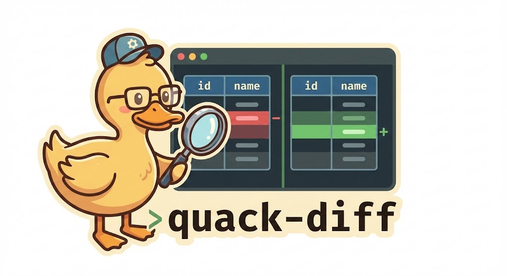

# quack-diff

Regression testing tool for modern data warehouses, powered by duck-db

<!-- markdownlint-disable-next-line MD057 -->


## Features

- **DuckDB-First Architecture**: Uses DuckDB as a universal adapter for database connectivity
- **Dialect-Safe Hashing**: Handles NULL values and type mismatches correctly across databases
- **Time-Travel Support**: Compare data against historical snapshots (Snowflake, Delta Lake)
- **CI/CD Ready**: Exit codes for pipeline integration, environment variable configuration
- **User-Friendly**: Rich terminal output with beautiful diff tables

## Quick Start

### Basic compare

```bash
# Compare two tables
quack-diff compare --source db1.users --target db2.users --key id

# Compare with threshold (allow up to 1% difference)
quack-diff compare --source prod.orders --target dev.orders --key order_id --threshold 0.01
```

### Time-Travel compare (Snowflake)

```bash
# Compare current data with 5 minutes ago
quack-diff compare \
  --source snowflake.orders \
  --target snowflake.orders \
  --source-at "5 minutes ago" \
  --key order_id
```

### Schema Comparison

```bash
quack-diff schema --source db1.users --target db2.users
```

### Count check (bronze/silver/gold)

Validate that pipeline layers have the same number of rows or distinct keys (no row loss):

```bash
# Same row count across layers
quack-diff count -t bronze.orders -t silver.orders -t gold.orders

# Same distinct ID count
quack-diff count -t bronze.orders -t silver.orders -t gold.orders --key order_id

# Per-table GROUP BY (count distinct groups in second table)
quack-diff count \
  -t sf.GOLD.FCT_INVOICE \
  -t "sf.RAW.INVOICE_LINES[salesid,linenum,tariffcode,linestartdate]"

# Add SUM validation alongside row counts
quack-diff count \
  -t sf.GOLD.FCT_INVOICE \
  -t "sf.RAW.INVOICE_LINES[salesid,linenum]" \
  --sum-column QUANTITY --sum-column qty

# Allow tolerances (percentage or absolute)
quack-diff count \
  -t bronze.orders -t silver.orders \
  --sum-column amount \
  --count-threshold 1% \
  --sum-threshold 500

# JSON for CI/CD
quack-diff count -t bronze.orders -t silver.orders -t gold.orders --key order_id --json
```

## How It Works

quack-diff leverages DuckDB's extension system to connect to external databases:

1. **Attach**: Mount remote databases using DuckDB extensions (snowflake)
2. **Hash**: Generate row-level hashes using dialect-safe SQL (handles NULLs, type coercion)
3. **Compare**: Identify mismatches by comparing hash values
4. **Report**: Display results in beautiful terminal tables

## Next steps

- [Installation](installation.md) — Install quack-diff with uv or pip
- [Configuration](configuration.md) — Environment variables and config file
